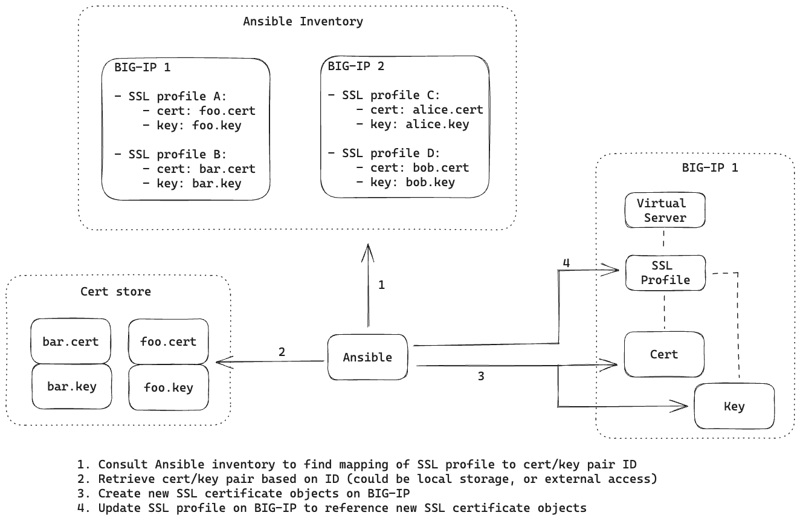

# BIG-IP SSL Certificate Management

This project provides an Ansible playbook to manage SSL certificates on BIG-IP using the F5Networks.F5_Modules.



> This is intended for brownfield deployments, hence some non-idempotent patterns are employed.

## Prerequisites

- Ansible installed on your system.
- [mkcert](https://github.com/FiloSottile/mkcert) utility installed and configured to generate SSL certificates.
- [F5Networks.F5_Modules collection](https://galaxy.ansible.com/ui/repo/published/f5networks/f5_modules/) installed.
- Access to one or more BIG-IP instances with appropriate credentials.

## Usage

1. Generate SSL certificate and key using mkcert
      ```
      cd certs
      mkcert foo.example.com
      mkcert bar.example.com
      ```
1. Create [certs](./certs) directory in the project root and place your SSL certificate and key files there.
1. Using [bigip.test](./inventory/host_vars/bigip.test/) as example, create host directories under [inventory/host_vars/](./inventory/host_vars/) with the corresponding variables.
2. Update [inventory](./inventory/inventory.ini) with the added hosts.
3. Run the playbook:
      ```
      ansible-playbook -i inventory/inventory.ini main.yml
      ```

## Test

```
openssl s_client -connect <BIG-IP VIP>:443 </dev/null 2>/dev/null | openssl x509 -noout -text | grep DNS:
```